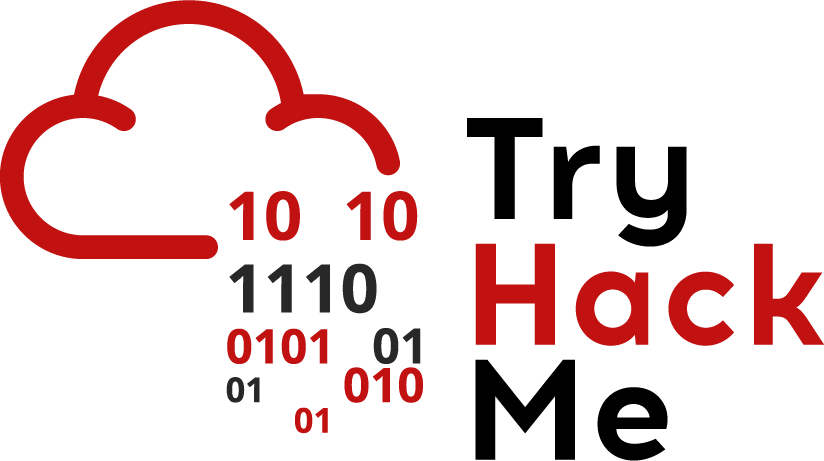

<h1 align="center">Hi There 👋 it's me Ravi</h1>
<h3 align="center">A cybersecurity and ethical hacking enthusiast. Fully immersed in the world of cybersecurity, I’m focusing on protecting digital landscapes and uncovering vulnerabilities to build more secure systems. I’m driven by a commitment to ethical practices and continuous learning in the ever-evolving field of cybersecurity.</h3>

Here’s a peek into who I am :

- 🌱 I’m currently learning: cybersecurity and ethical hacking 
- 📫 How to reach me: https://nexgen-5cc26.web.app/ 
- ⚡ Fun fact: The term 'bug' in computing was inspired by a real bug 😂  found by Grace Hopper in 1947

<h3 align="left">Connect with me:</h3>

 
 

  

<h3 align="left">Languages and Tools:</h3>

    

